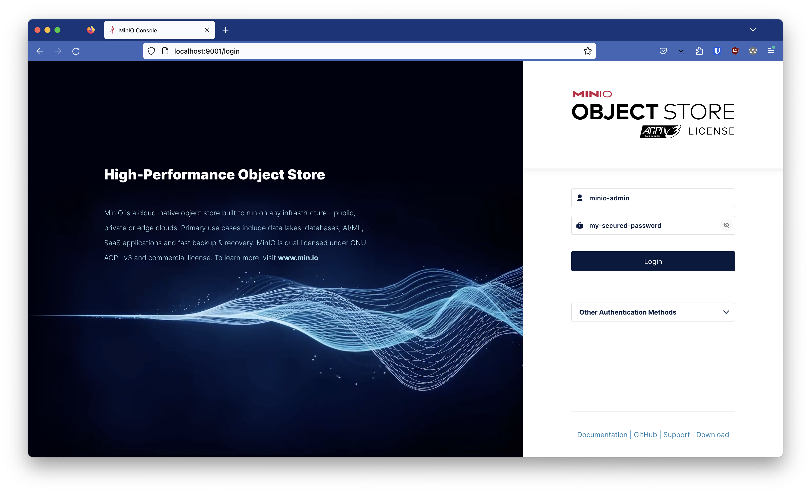
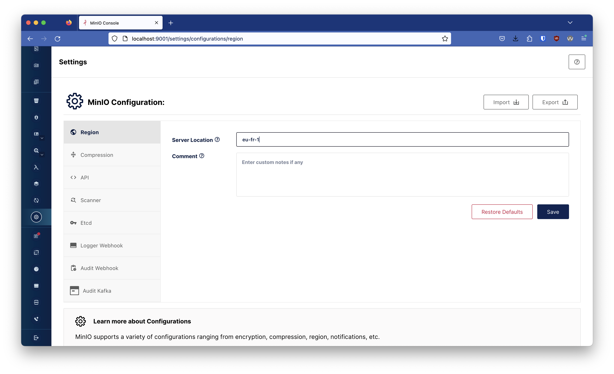
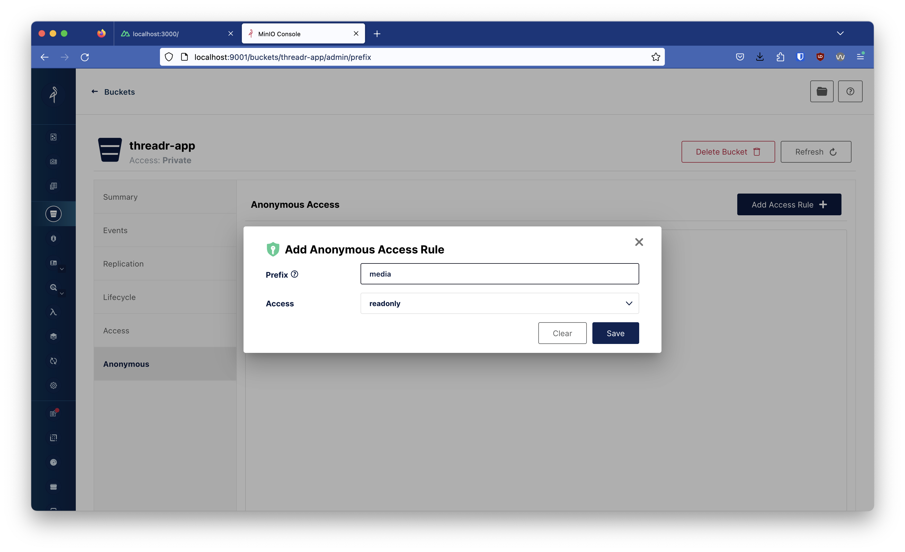
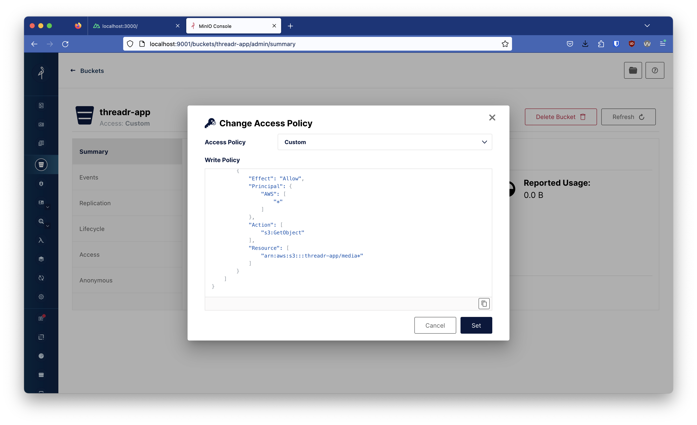

# Threadr

Threadr is a small (#workinprogress) web application that helps users of micro-blogging platforms to write great threads and allows them to crosspost in one click their content to Bluesky, Mastodon and Twitter/X.

## Core features

* Write thread
  * Add, edit, remove messages
  * Add, describe, remove message images (up to 4 by message)
* Save a thread
* List all threads (by status, e.g. `draft`, `scheduled`, `published`)
* Publish a thread
* Schedule (and cancel) a thread publication
* Configure platforms in a settings manager
  * display name
  * avatar
  * Bluesky activation and configuration
  * Mastodon activation and configuration
  * Twitter activation and configuration

## Installation

For now, Threadr only works in localhost.

**1/** Get the project sources

```shell
$ git clone git@github.com:jbuget/threadr-app.git && cd threadr-app
```

**2/** Copy the `.env.sample` file into a new `.env` file

You previously must generate, get and report your access keys for Twitter/X (new developer project), Mastodon (new app) and Bluesky (your user credentials).

**3/** Run the Docker compose service `minio` (required to upload media files into platforms)

```shell
$ docker compose up -d
```

**4/** Configure your MinIO instance

MinIO console is accessible on [localhost:9001](http://localhost:9001). Credentials are defined in `.env`file, cf. `MINIO_ROOT_USER` and `MINIO_ROOT_PASSWORD`. By default, values are "minio-admin" / "my-secured-password".



Create a bucket (ex: "threadr-app" in `.env.sample`).


In the MinIO settings, configure MinIO region (ex: "eu-fr-1" in `.env.sample`).



> ⚠️ It is recommanded to declare a custom policy with dedicacted path in `readonly` acces for anonymous visitors





**5/** Run Threadr locally

```shell
$ npm install
$ npm run dev -- -o
```

**6/** 🚀 Enjoy Threadr at [localhost:3000](http://localhost:3000)!

<p align="center">
    
</p>

**7/** (bonus) You can follow your scheduled threads in BullMQ console

Run the following command : 

```shell
$ npx bullmq-dashboard-runnable thread-schedules -P 3001
```

Then access [localhost:3001](http://localhost:3001).


## Configuration

All configuration option are set in the `.env` file.

<details>

<summary>Uploading media files</summary>

**`MINIO_ENDPOINT`: URL**

The endpoint URL of MinIO/S3 server on which temporarily upload media files.

**`MINIO_REGION`: string**

The region of the MinIO/S3 server.

**`MINIO_BUCKET_NAME`: string**

The bucket where the media files will be upload before being sent to platforms.

**`MINIO_MEDIA_PATH`: string**

The folder path inside the bucket.

**`MINIO_ACCESS_KEY`: string**

The MinIO access key to access the bucket in order to deposit media files.

**`MINIO_SECRET_KEY`: string**

The MinIO access secret key to access the bucket in order to deposit media files.

**`MINIO_ROOT_USER`: string**

The MinIO administration account username (used for docker-compose MinIO container).

**`MINIO_ROOT_PASSWORD`: string**

The MinIO administration account password (used for docker-compose MinIO container).

</details>

<details>
<summary>Persisting data</summary>

**`DATABASE_URL`: (PostgreSQL) URL**

The PostgreSQL database URL

**`POSTGRES_USER`: string**

The PostgreSQL administration account username (used for docker-compose postgres container).

**`POSTGRES_PASSWORD`: string**

The PostgreSQL administration account password (used for docker-compose postgres container).

**`POSTGRES_DB`: string**

The PostgreSQL database.

</details>

<details>

<summary>Scheduling thread publication</summary>

**`REDIS_URL`: (Redis) URL**

The Redis database URL, used by BullMQ.

</details>