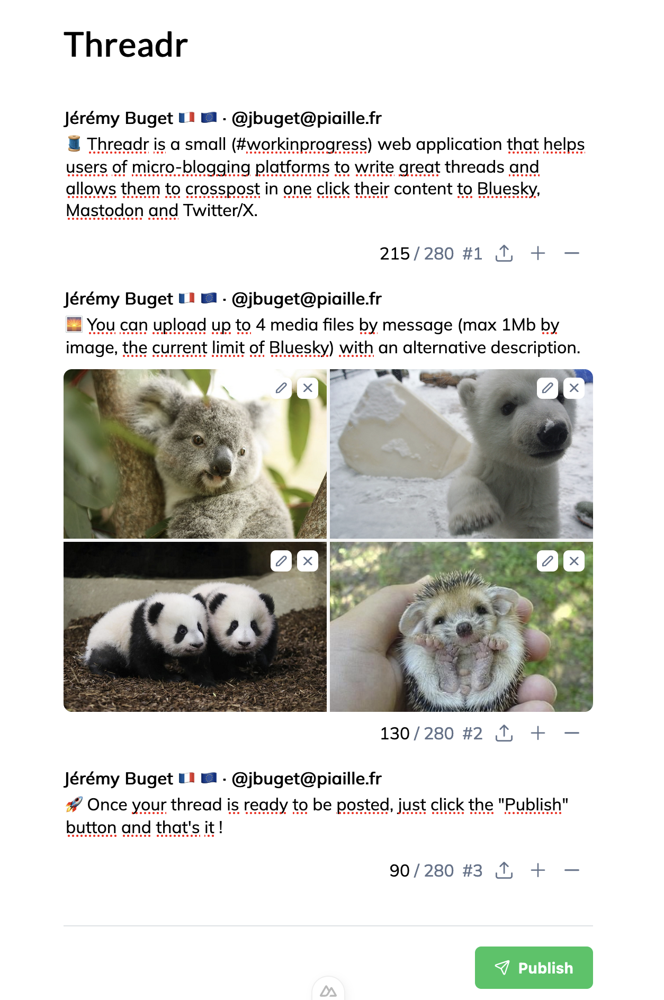

# Threadr

Threadr is a small (#workinprogress) web application that helps users of micro-blogging platforms to write great threads and allows them to crosspost in one click their content to Bluesky, Mastodon and Twitter/X.

## Installation

For now, Threadr only works in localhost.

**1/** Get the project sources

```shell
$ git clone git@github.com:jbuget/threadr-app.git && cd threadr-app
```

**2/** Copy the `.env.sample` file into a new `.env` file

You previously must generate, get and report your access keys for Twitter/X (new developer project), Mastodon (new app) and Bluesky (your user credentials).

**3/** Run the Docker compose service `minio` (required to upload media files into platforms)

```shell
$ docker compose -d minio
```

**4/** Configure your MinIO instance

MinIO console is accessible on [localhost:9001](http://localhost:9001) (credentials in `.env`file, cf. `MINIO_ROOT_USER` and `MINIO_ROOT_PASSWORD`)

Create a bucket (ex: "threadr-app" in `.env.sample`).

In the settings, configure MinIO region (ex: "eu-fr-1" in `.env.sample`).

> ⚠️ It is recommanded to declare a custom policy with dedicacted path in `readonly` acces for anonymous visitors

**5/** Run Threadr locally

```shell
$ npm install
$ npm run dev -- -o
```

**6/** 🚀 Enjoy Threadr at [localhost:3000](http://localhost:3000)!



